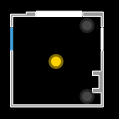

Hass-floorplan is a home assistant floorplan module for [looking glass](http://github.com/glasslabs/looking-glass)



## Usage

Clone the hass-floorplan into a path under your modules path and add the module path
to under modules in your configuration.

```yaml
modules:
  - name: floorplan
    url:  https://github.com/glasslabs/hass-floorplan/releases/download/v1.0.0/hass-floorplan.wasm
    position: top:right
    config:
      url: http://my-hass-instance:8123
      token: <your-hass-token>
      floorplan: {{ .ConfigPath }}/assets/floorplan.svg
      mapping:
        your-entity: your-svg-element
```

## Configuration

### URL (url)

*Required*

Your home assistant instance URL, in the form of `http://home.assistant:8123/`.

### Token (token)

*Required*

You home assistant API token.

### Floorplan (floorplan)

*Required*

The path to your floor plan SVG file.

### Custom CSS (customCss)

*Optional*

The custom CSS file to style the SVG states. The element states are `on`, `off` and `unavailable`, although `off` should
be the default state and not relied on to be set.

The default stylesheet uses classes `light` and `door` to style different elements.

### Entity Mapping (mapping)

*Optional*

An optional mapping from home assistant entity name to SVG element name.
